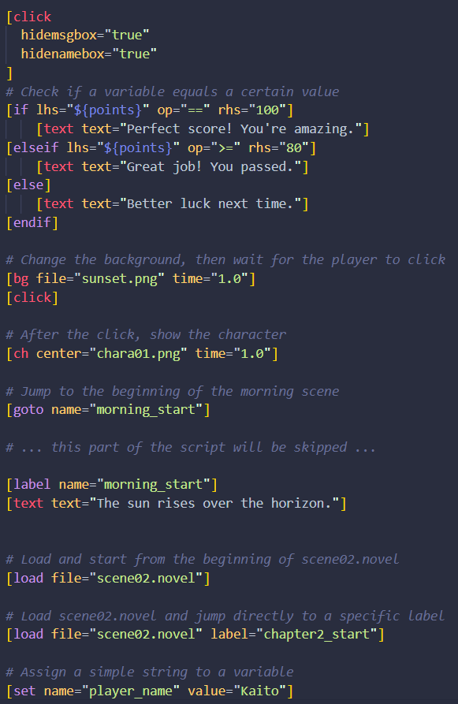

# NovelML Highlighter

> **Language:** English | [简体中文](#novelml-高亮器)

A **multi-editor syntax highlighting extension pack** for the **NovelML** visual novel scripting language.Designed to enhance the readability and development experience of writing scripts. 

**Visual Novel Engine Project:** [Suika3](https://github.com/awemorris/suika3)

---

### Features

- **Core Functionality**: Full syntax support based on TextMate rules, accurately identifying tags, attributes, variables, and comments.
- **Use Case**: Designed to be used with the [Suika3](https://github.com/awemorris/suika3)  engine, making script writing clearer and more efficient.

---

### NovelML 高亮器

> **语言:** [English](#novelml-highlighter) | 简体中文

这是一个专为 **NovelML** 视觉小说脚本语言设计的 **多编辑器高亮插件合集** ，旨在提升剧本编写的可读性和开发体验。

- **核心功能**：基于 TextMate 规则的完整语法支持，精准识别标签、属性、变量和注释。
- **适用场景**：配合 [Suika3](https://github.com/awemorris/suika3) 引擎使用，让剧本编写更加清晰高效。

### 效果预览

安装插件并应用主题后，你的代码将呈现如下效果：
> **注意**: 具体高亮颜色因编辑器主题而异。

